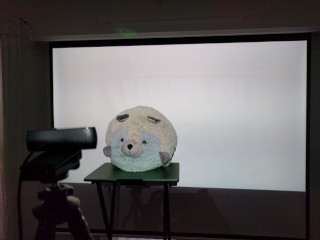
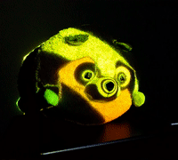
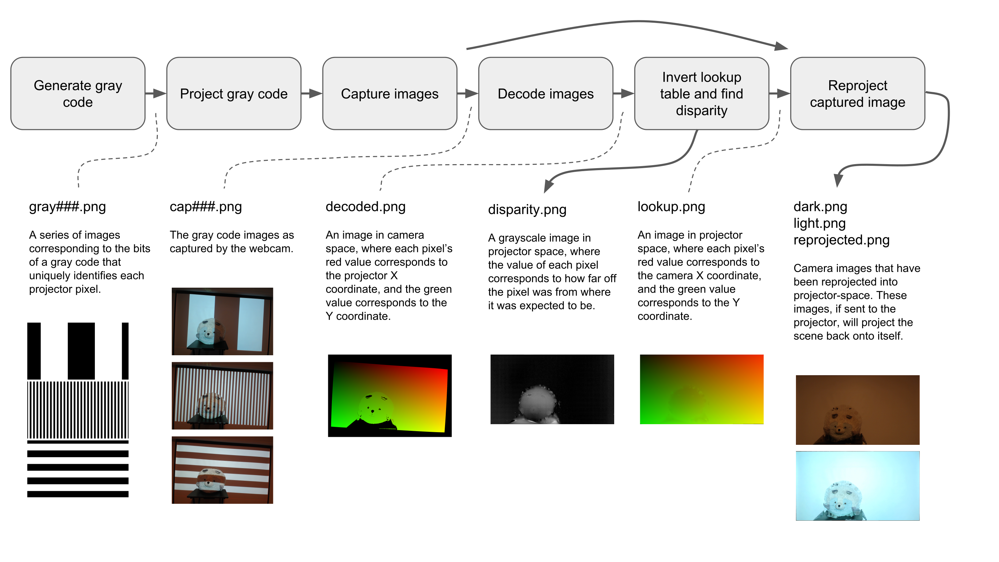
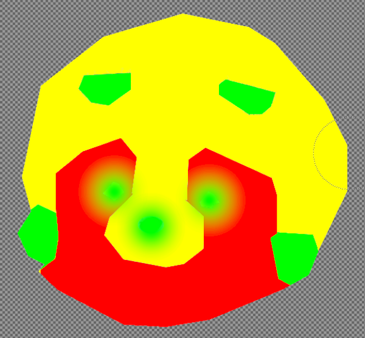
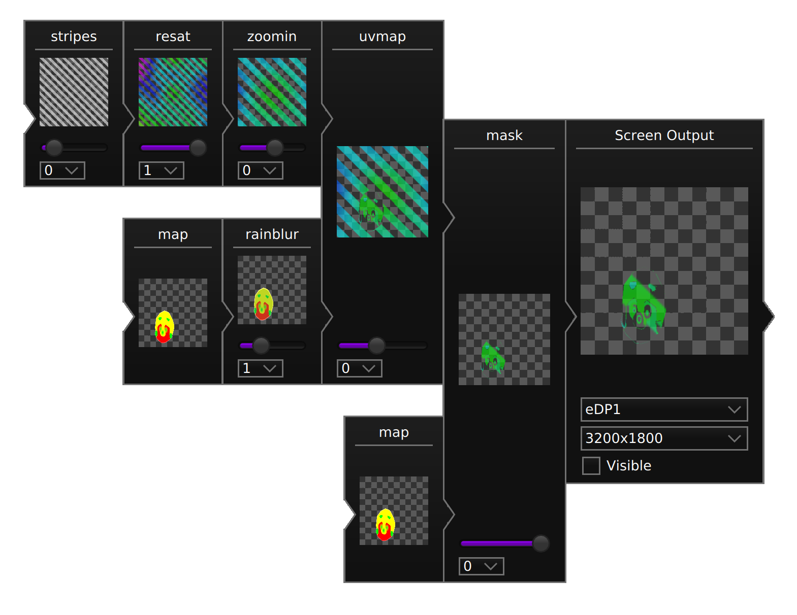

# promap



## What is it?

`promap` is a command-line tool that you can use
in conjunction with your digital video workflow
to do projection mapping.

`promap` uses a projector and a single camera
to compute the physical scene as viewed from the projector,
as well as a coarse disparity (depth) map.

You can import the maps that it generates straight into your [digital video workflow](https://radiance.video),
or you can post-process them into masks and uvmaps first using image processing tools.

## How does it work?



1. Generate gray code images
2. Project the gray code images
3. Capture the images using the camera
4. Decode the images into a lookup table that goes from camera to projector space
5. Invert the lookup table so it goes from projector to camera space, and compute a disparity map using least-squares fitting
6. Reproject camera's view of the scene (using the inverted lookup table) producing the projector's view of the scene

`promap` will automatically perform all of these steps for you.
The scanning only takes about a minute.

You can also perform a subset of these tasks,
either to introspect the data,
or to tweak the pipeline to your satisfaction.
The output of any of step can be saved,
and the input to any step can be loaded.

> N.B. In step 2, "project" refers to displaying pictures on a video projector.
> In step 6, "reproject" refers to a mathematical computation and does not require a video projector.

## Examples

### Do everything

```
promap -af
```

* The `a` flag runs all operations.
* The `f` flag stores all intermediate results into files.

You may also want:

* The `v` flag to turn on verbose logging so you can see what is going on.
* The `w` flag to set the working directory (since a lot of files will be generated)
* The `--camera` flag to set the camera device to use

### Scan only

```
promap -gpc
```

`g` for generate, `p` for project, `c` for capture.

The result will be a series of `cap###.png` files ready for analysis.

### Analyze only

```
promap -dir --projector-size 1920x1080
```

You will need the series of `cap###.png` files from the previous step.

`d` for decode, `i` for invert, `r` for reproject.

The result will be a disparity map in `disparity.png`,
and the first two reprojected captures (`cap000.png` and `cap001.png`) in `dark.png` and `light.png`.

You may also want:

* The `--scene` flag to reproject your own image (instead of `cap000.png` and `cap001.png`)

## Post-processing

In this example, the final `light.png` image was brought into GIMP, and zones were defined using solid colors. A slight gradient was used to draw attention to certain features.



This map was then brought into Radiance, and used as an input to `uvmap` and `mask`.


The result is the GIF at the top of this page.

## What is the status of the project?

It should work, but it is not thoroughly tested. Please let me know if there are any problems or feature requests!
